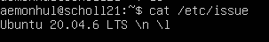

# Task 1 — Ubuntu Server Installation

Installed Ubuntu 20.04 Server LTS without graphical interface using VirtualBox.

## Verification

Output of `cat /etc/issue` confirming clean server installation.
