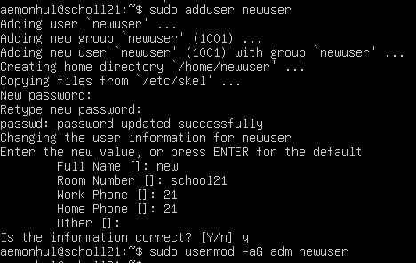
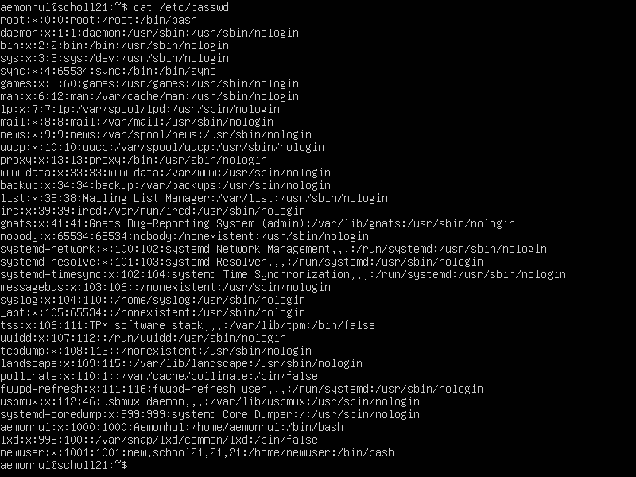

# Task 2 — User Management

Created a new user and added it to the `adm` group for administrative access.

## Creating User

Using `sudo adduser newuser` and `sudo usermod -aG adm newuser`

## Verification

Output of `cat /etc/passwd` showing the new user entry.
