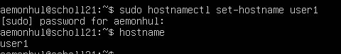
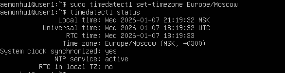
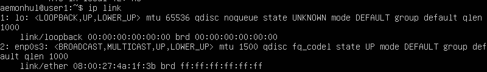
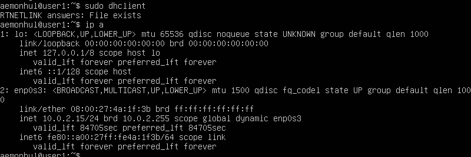
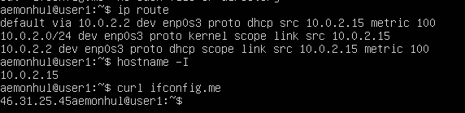
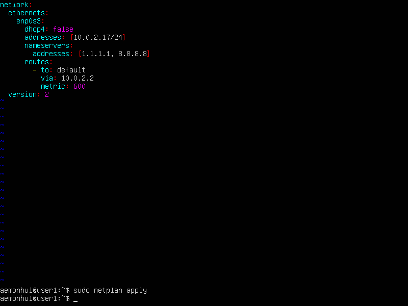
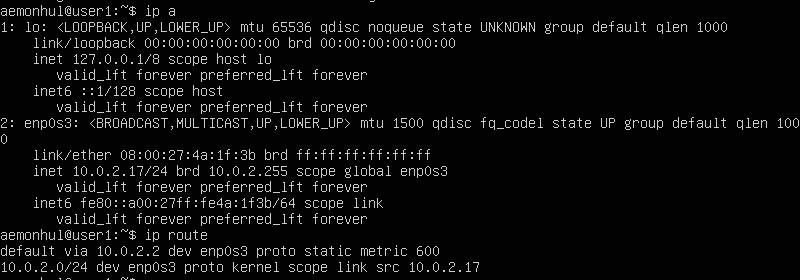
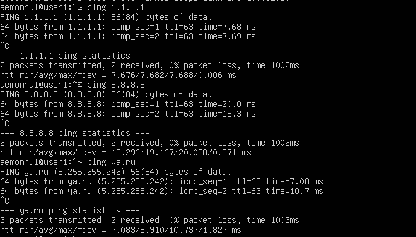

# Task 3 — Network Configuration

Configured hostname, timezone, network interfaces, and static IP settings.

## Hostname Setup

Setting machine name with `hostnamectl set-hostname`

## Timezone Configuration

Setting timezone with `timedatectl set-timezone`

## Network Interfaces

Listing all network interfaces with `ip link`

> **lo (loopback)** — virtual network interface used for local testing and services.

## DHCP IP Address

Obtaining IP from DHCP server using `dhclient` and verifying with `ip a`

## Gateway IPs

Displaying internal and external gateway IPs with `ip route`, `hostname -I`, and `curl ifconfig.me`

## Static Network Configuration

Configuring static IP, gateway, and DNS via `/etc/netplan/` YAML file.

## Verification After Reboot

Confirming static settings persist after reboot.

## Connectivity Test

Successfully pinging remote hosts with 0% packet loss.
