# Task 8 — System Monitoring

Explored various system monitoring tools and commands.

## Disk Usage

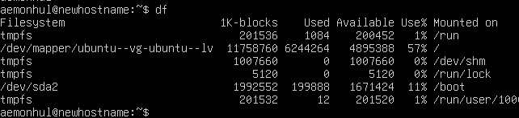

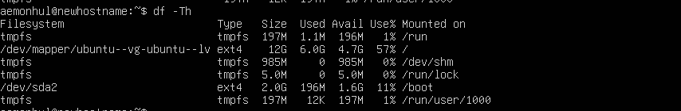

Using `df` and `df -Th` to check filesystem usage.

## Directory Sizes

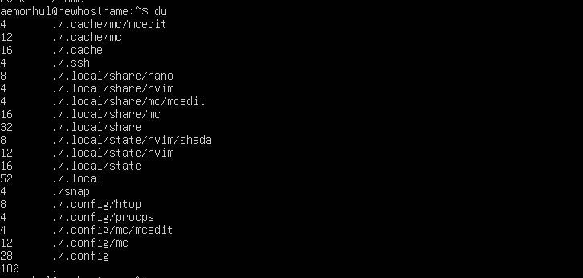

Using `du` with various flags to analyze directory sizes.

## Memory Usage

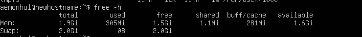

Checking RAM usage with `free -h`.

## Processes

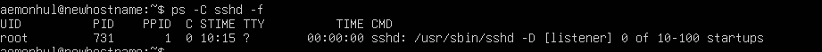

Listing processes with `ps aux`.

## Interactive Monitoring

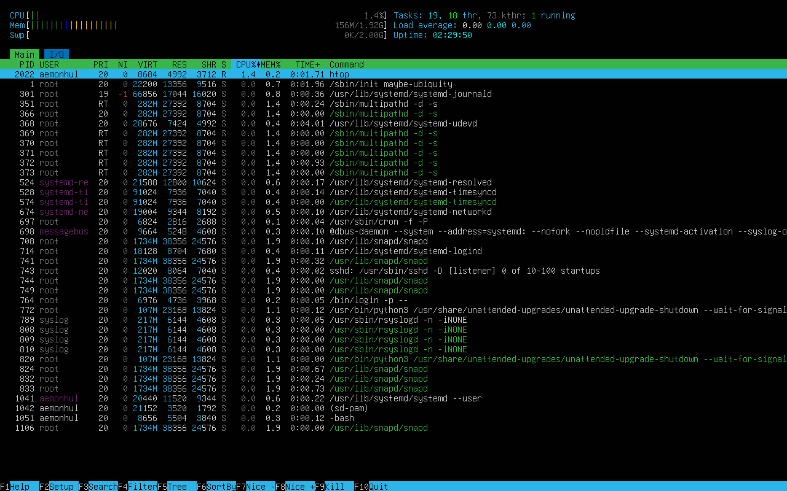

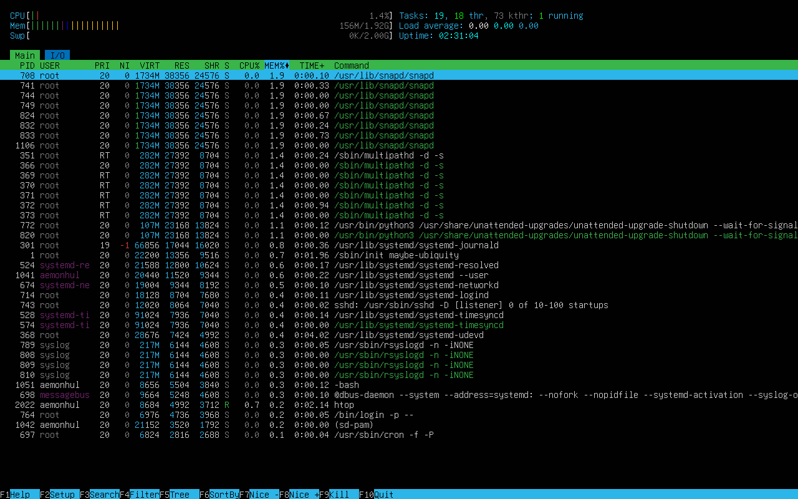

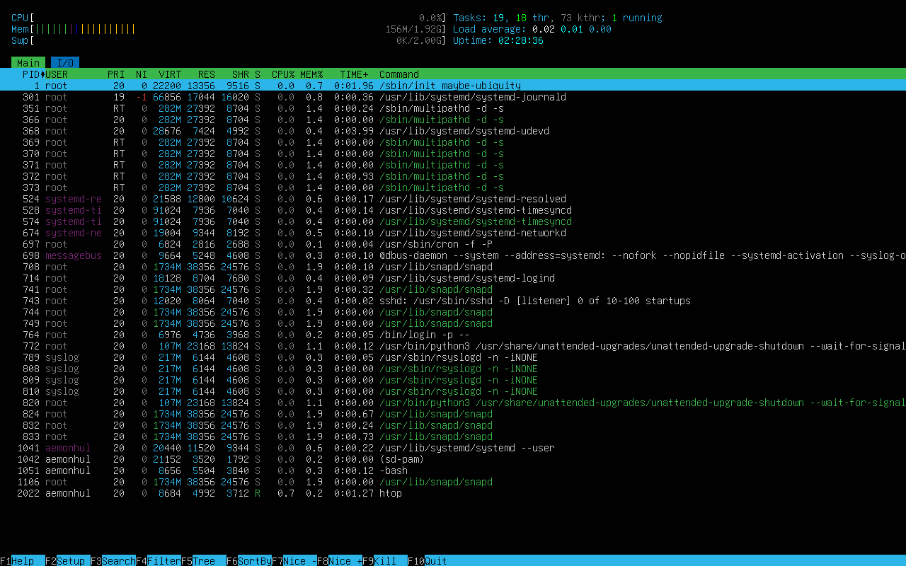

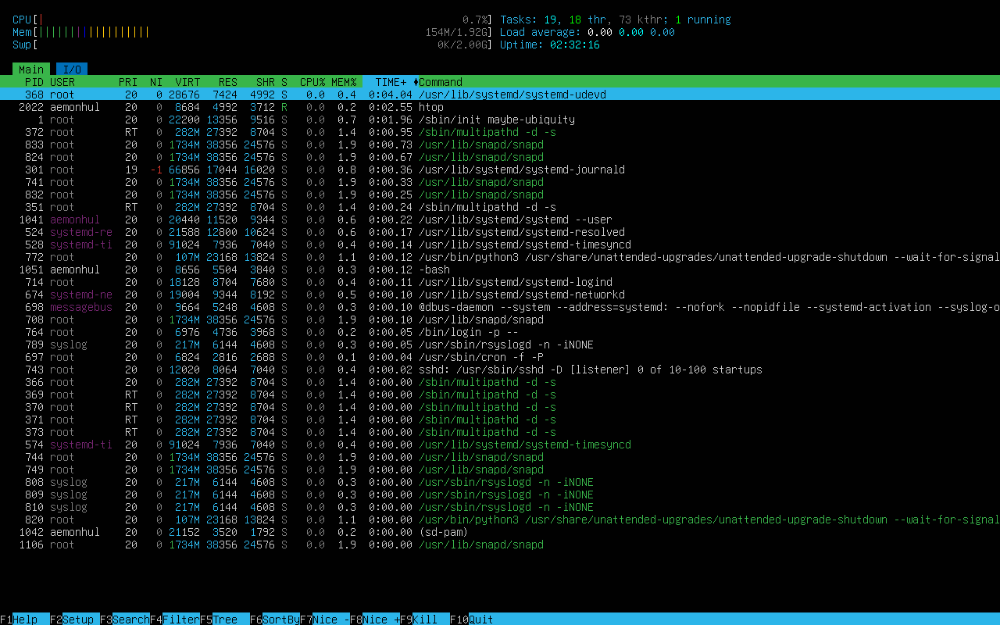

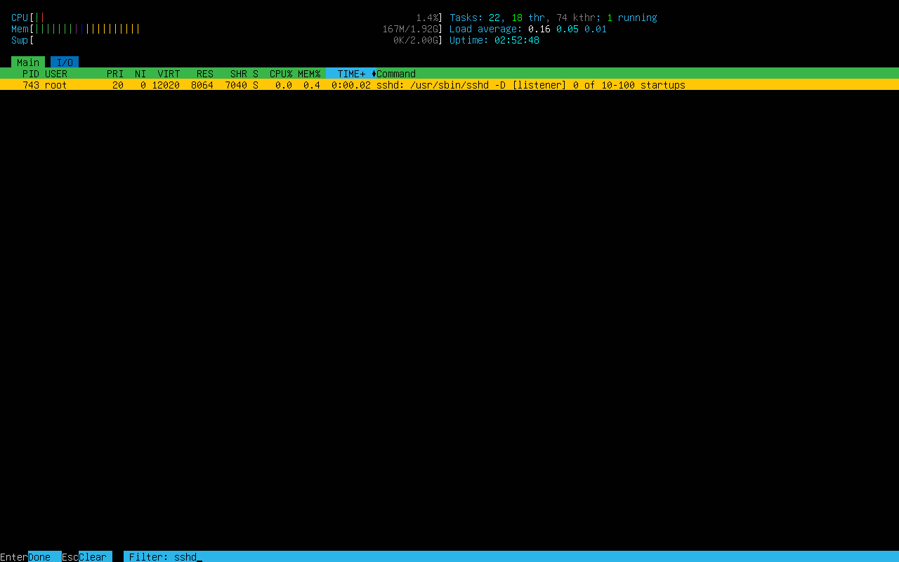

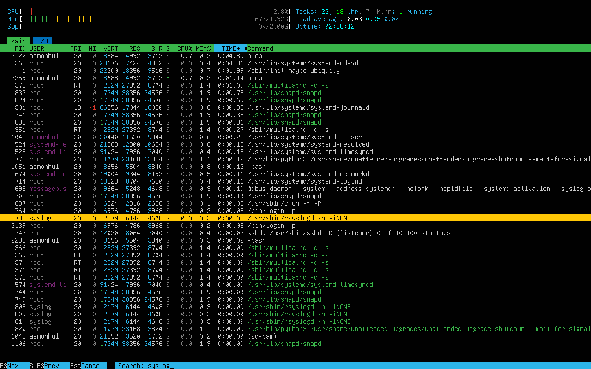

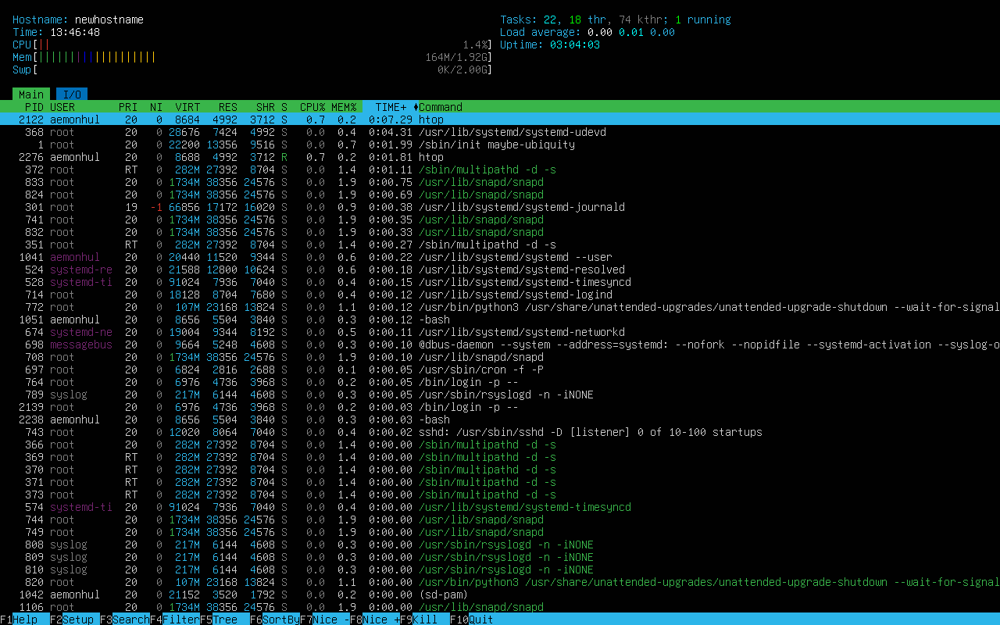

Using `htop` with various sorting, filtering, and display options.

## Disk Analysis Tools

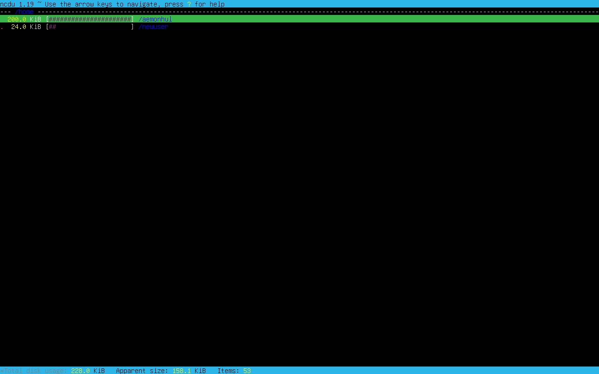

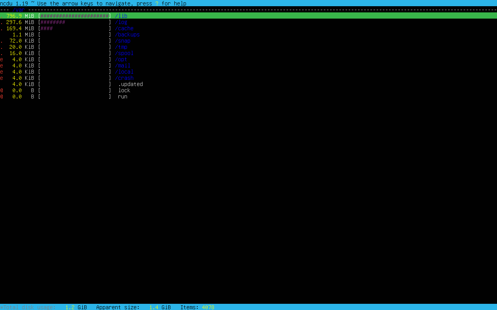

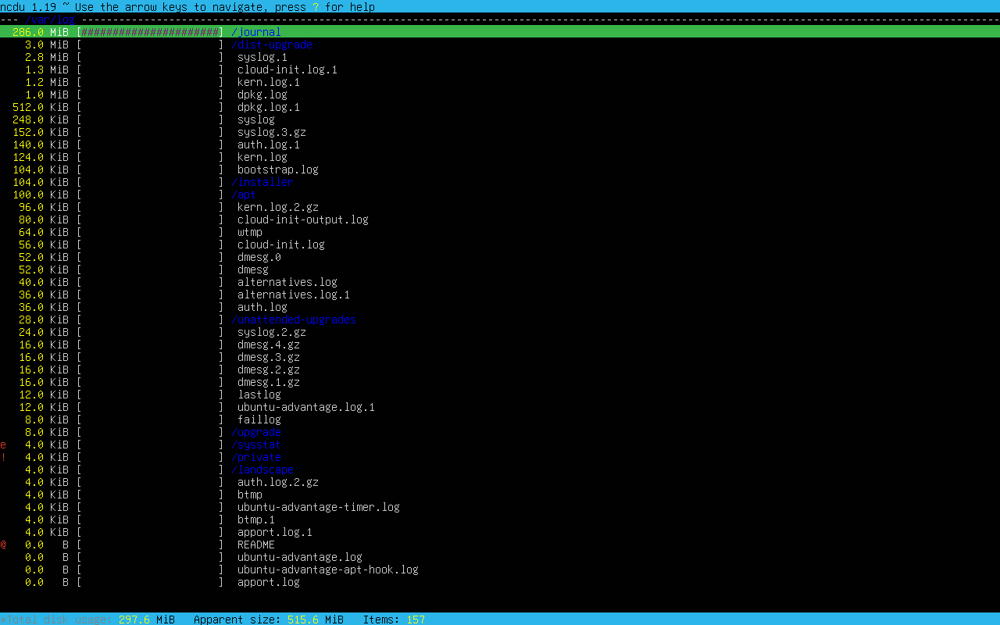

Interactive disk usage analysis with `ncdu`.

## Disk Partitions

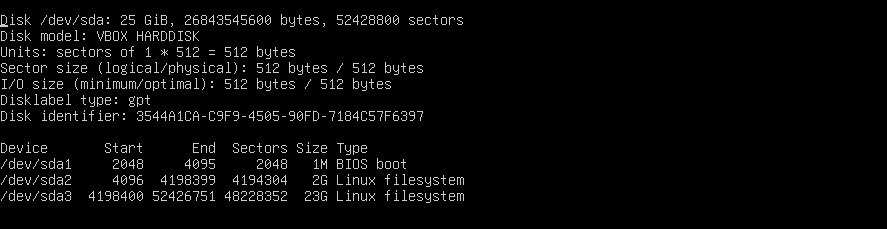

Viewing disk partitions with `fdisk -l`.
