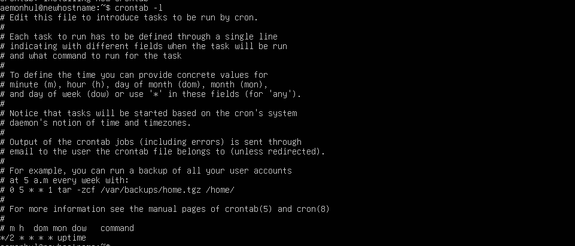
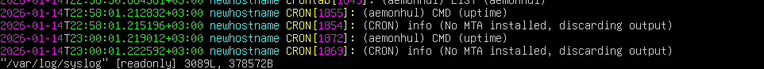
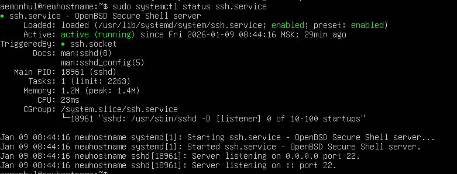
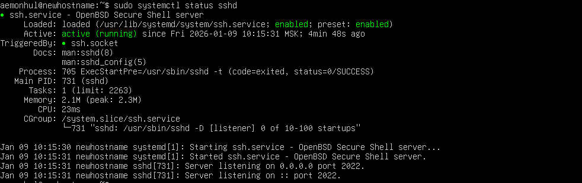
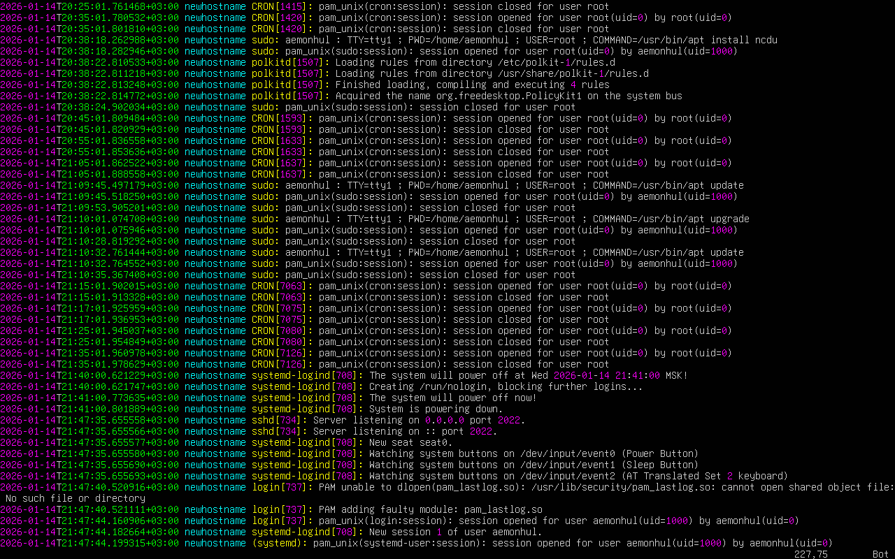

# Task 9 — Scheduled Tasks

Configured cron jobs for automated task scheduling.

Setting up cron jobs with `crontab -e` and listing with `crontab -l`.

## Log Verification

Verifying cron execution in system logs.

## SSH Service Status

Checking SSH service status.

## Port Check

Verifying open ports with `netstat`.

## Auth Log

Reviewing authentication logs.
